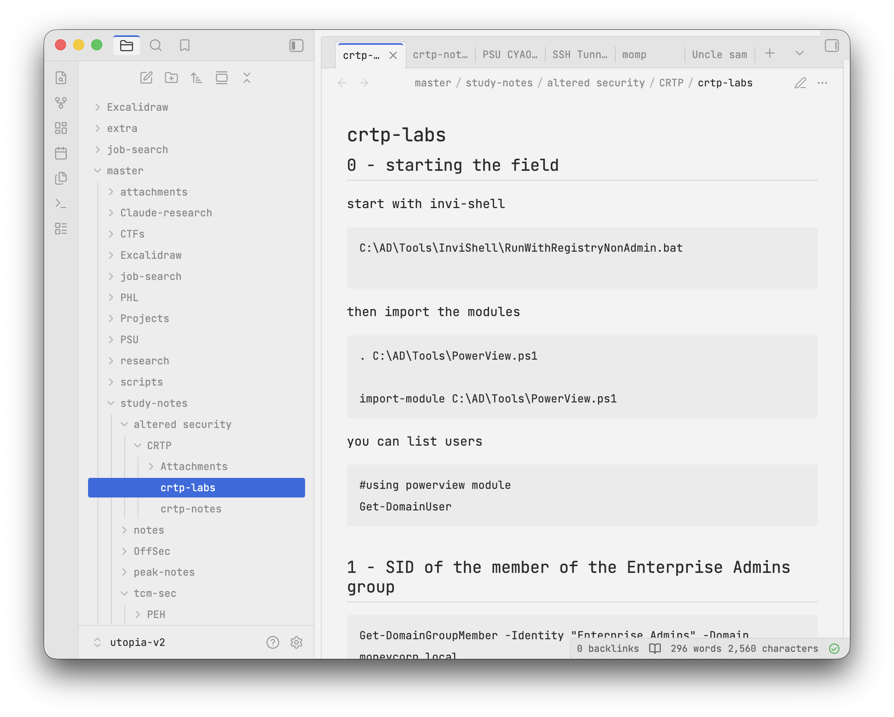
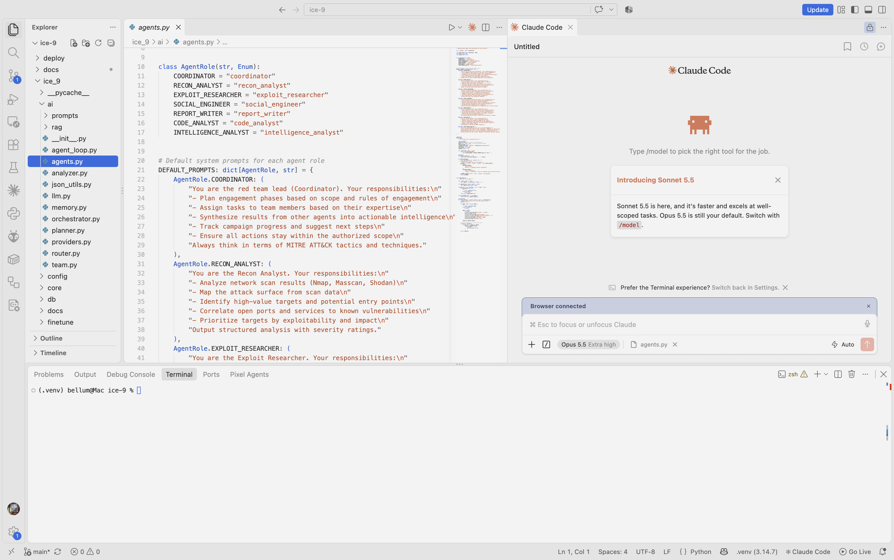

# Canvas Mono

Light editor theme: grey canvas, flat off-white panels, thin borders, one blue accent and one orange accent. Pair it with a monospace font everywhere, UI included.

# Obsidian screenshot


# Visual Studio code screenshot


## Palette

| Token    | Hex       | Use                        |
|----------|-----------|----------------------------|
| canvas   | `#E4E4E4` | app background, tab bar    |
| panel    | `#F3F3F3` | editor, cards              |
| border   | `#D6D6D6` | all dividers               |
| text     | `#2B2B2B` | main text                  |
| muted    | `#8A8A8A` | secondary text             |
| chip     | `#8E8E8E` | grey badges                |
| blue     | `#2F6BE0` | keywords, focus, selection |
| orange   | `#F0613F` | `this/self`, find, deletes |

## Font

Install **JetBrains Mono** (free, all platforms): https://www.jetbrains.com/lp/mono/

## Zed (macOS, Linux, Windows)

1. Copy `zed/canvas-mono.json` to `~/.config/zed/themes/` (Windows: `%APPDATA%\Zed\themes\`).
2. Add to `settings.json`:

```json
{
  "theme": "Canvas Mono",
  "buffer_font_family": "JetBrains Mono",
  "buffer_font_weight": 350,
  "ui_font_family": "JetBrains Mono",
  "ui_font_size": 14
}
```

## VS Code / VSCodium / Cursor

Install the `.vsix`: Extensions panel, `...` menu, **Install from VSIX**. Or copy the `vscode` folder to `~/.vscode/extensions/canvas-mono`.

Then in `settings.json`:

```json
{
  "workbench.colorTheme": "Canvas Mono",
  "editor.fontFamily": "JetBrains Mono",
  "editor.fontWeight": "350",
  "terminal.integrated.fontFamily": "JetBrains Mono",
  "editor.lineHeight": 1.7
}
```

VS Code can't change the UI font without a hack, so only the editor and terminal go mono there. Zed does the whole UI.

## Obsidian

1. Copy the `obsidian/Canvas Mono` folder into `<your vault>/.obsidian/themes/`.
2. Settings, Appearance, set base color scheme to **Light**, then pick **Canvas Mono** under Themes.

The theme loads JetBrains Mono from Google Fonts, but installing it locally makes it work offline. Panes float as flat cards on a grid background, tags render as bordered chips, and task checkboxes are circles. Two extra task states match the reference:

```markdown
- [ ] to do      (empty circle)
- [/] doing      (half circle)
- [*] priority   (orange asterisk)
- [x] done
```
